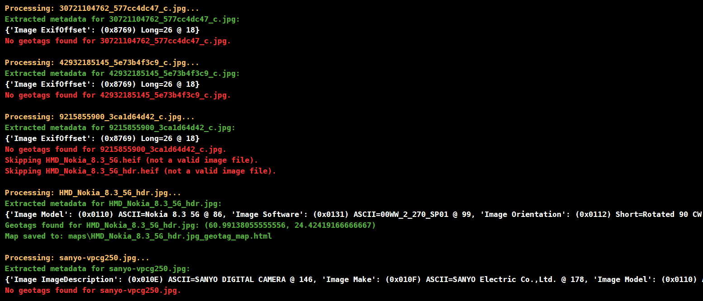

# OSINT Metadata Extractor

## Features
- **EXIF Metadata Extraction**: Extract detailed metadata from images, including camera model, make, and other technical information.
- **Geotag Extraction**: Retrieve geolocation data from images, including GPS coordinates (latitude and longitude) when available in EXIF metadata.
- **Interactive Map Visualization**: Visualize geotags on an interactive map with markers, saved as HTML files for easy sharing.
- **Batch Processing**: Process multiple image files in a directory at once, extracting metadata and generating maps for each image.
- **Supports Popular Image Formats**: Works with `.jpg`, `.jpeg`, and `.png` image files to extract and visualize metadata.

## Showcase



## Installation
1. Clone the repository:
   ```bash
   git clone https://github.com/GitEagleY/Photo_Metadata_Extractor.git
   cd Photo_Metadata_Extractor
   ```
2. Install dependencies:
   ```bash
   pip install -r requirements.txt
   ```

## Launch the Tool
Run the tool from the command line:
```bash
python main.py
```

